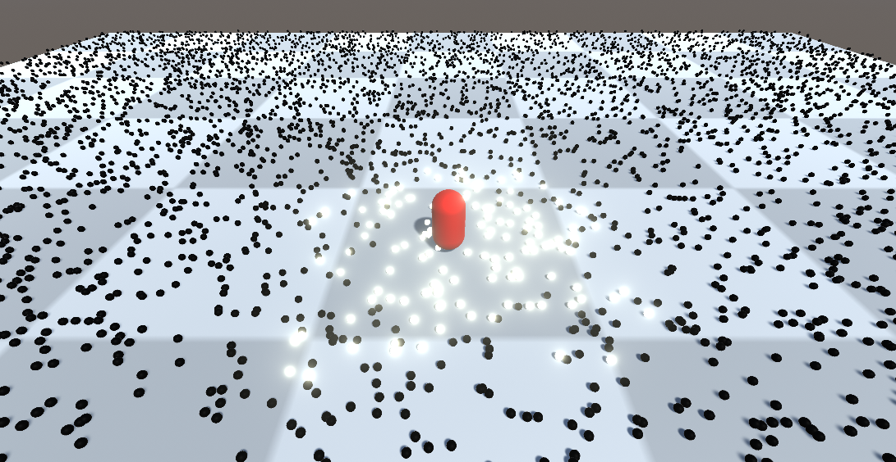

# 一様分割
赤色のオブジェクトがプレイヤーです。
プレイヤーのいる位置のセルのオブジェクトを明るくします。
現在、球が動くと、明るさが同じままで動いてしまうので、球が移動したら別のセルに移動させて下さい。

想定完成状態

現在の状態は、球が動いても、そのままの明るさで拡散していってしまいます。

# 取り組み方
* 本プロジェクトをforkして、取り組んでください。
* 「grip」にオブジェクトにアタッチされている、「GridBehaviourScript」の「updatePosition」が未実装なので、セルを移動していたら球を別のセルに移して下さい。
* ほかにもかっこよくできるのであれば、拡張してください。
* よくわからない場合は、何が分からないか（どこまでわかったか）README.mdのどこかに記載してください

# 〆切
5/31(月)
